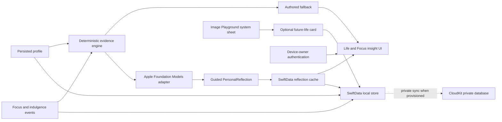

## Context

See `proposal.md` for motivation. Indulge currently has two flat SwiftData Focus
models, an in-memory `OnboardingProfile`, deterministic daily aggregation, and a
protocol-backed Foundation Models tag suggester. The production model
configuration explicitly disables CloudKit. The project has no entitlements,
developer-team identifier, backend account, or server-side identity contract.

Current Apple platform constraints shape the architecture:

- Foundation Models requires runtime availability checks and may be unavailable
  because Apple Intelligence is disabled or the model is not ready.
- SwiftData CloudKit sync requires iCloud and remote-notification capabilities,
  an administrator-configured container, and a CloudKit-compatible schema.
  CloudKit cannot enforce SwiftData unique constraints.
- Current Image Playground guidance favors the system-managed sheet; the
  programmatic `ImageCreator` path is deprecated in the installed SDK.
- Passkeys require a relying-party server and associated domain. Sign in with
  Apple creates an application-account contract; neither is needed for private
  CloudKit sync or a local privacy lock.

## Goals / Non-Goals

**Goals:**

- Make native intelligence a shared, testable capability instead of isolated UI code.
- Ground every generated statement in typed, deterministic evidence.
- Persist the person's profile and generated state before adding private sync.
- Adopt Apple-native visual creation and device-owner authentication only at
  moments where each provides clear value.
- Separate local implementation success from external CloudKit provisioning truth.

**Non-Goals:**

- A chat assistant, autonomous coach, productivity scoring, or model-authored diagnosis.
- Runtime generation of the core character, room, indulgence plates, or causal animations.
- Private Cloud Compute or transmission of raw notes.
- A custom backend, social account, Sign in with Apple, or passkey relying party.
- Silent permissions, a first-launch account wall, or degraded behavior on unsupported devices.

## Decisions

### 1. One capability boundary owns optional Apple services

Introduce an environment-injected capability snapshot and protocol-backed
services for language intelligence, visual creation, cloud configuration, and
device-owner authentication. Views consume semantic states such as available,
unavailable with a reason, working, and failed; they do not import framework
availability logic independently.

This keeps unsupported-device behavior deterministic and makes simulator tests
possible. Direct framework calls from each screen were rejected because they
would duplicate availability, cancellation, and error handling.

### 2. Deterministic evidence precedes generative narration

The existing summary engine remains the source of truth. It produces a compact
`EvidencePacket` containing only profile choices and calculated counts,
durations, distributions, evidence timestamps, and sample size. Foundation
Models uses guided generation to return a bounded `PersonalReflection` with a
headline, observation, and optional gentle question. The output schema carries
the evidence revision used to create it.

The existing tag suggester becomes another operation of the shared intelligence
service. Explicit selections always overwrite suggestions. A generated
reflection is cached in SwiftData and invalidated when its evidence revision
changes. Free-form model output directly embedded in the UI was rejected because
it cannot provide the same factual or layout guarantees.

### 3. Use a versioned, CloudKit-compatible SwiftData schema

Add persisted profile, generated reflection, and future-life-card metadata
models under a versioned schema and migration plan. Remove `@Attribute(.unique)`
from synchronizable event identifiers because CloudKit cannot enforce it; retain
UUID identifiers, add indexes where useful, and perform deterministic in-app
deduplication and active-record repair. Avoid required model relationships;
continue using flat foreign UUIDs so independently arriving CloudKit records are safe.

Preview and test configurations continue to use memory-only or explicit local
stores with CloudKit disabled. Signed application builds switch to the explicit
private container only after the capability and container are provisioned.
Automatically discovering an arbitrary entitlement was rejected because it
makes the data destination implicit.

### 4. CloudKit is Apple sync, not application authentication

Private CloudKit sync relies on the person's system iCloud state and does not
introduce an Indulge login screen. The app records locally when iCloud or the
network is unavailable and avoids claiming a sync state it cannot prove.

Sign in with Apple is deferred until a future server-side account exists. A
passkey is also deferred because there is no relying party, challenge endpoint,
associated domain, recovery flow, or account-deletion contract. Adding either
now would create ceremony without enabling a product capability.

### 5. Use Image Playground as a user-controlled keepsake

Offer one optional future-life-card action after the product has enough profile
context. Present the system Image Playground sheet with bounded concepts derived
from selected life directions. Copy the returned image into application-owned
storage only after success and persist metadata separately. The person can
replace or delete the card.

The creation entry point lives in Life after onboarding, near the person's
chosen life directions. It does not extend the onboarding sequence or compete
with the causal indulgence assembly.

The card never becomes a required onboarding asset or the animation source of
truth. This preserves consistent art direction and prevents unsupported devices
from receiving a lesser core experience.

### 6. Use device-owner authentication for privacy, not identity

An opt-in privacy lock uses the system device-owner policy so Face ID, Touch ID,
or device passcode follows platform availability. Enabling the setting requires
one successful authentication. Protected content is obscured immediately when
the scene leaves active state and is revealed only after a successful check once
the configured relock interval elapses.

The setting contains no biometric data or application credential. A biometric-
only policy was rejected because passcode fallback is safer for recovery and
accessibility.

## Risks / Trade-offs

- **Model behavior changes with OS updates** -> Keep typed outputs, authored
  fallbacks, prompt regression fixtures, and version-aware evidence in tests.
- **Generated narration can sound more certain than the evidence** -> Constrain
  inputs and schema, retain sample-size language, and never generate below the
  deterministic evidence floor.
- **CloudKit migration can duplicate records** -> Remove unsupported uniqueness,
  retain stable UUIDs, deduplicate after import, and test multi-device conflict fixtures.
- **Cloud provisioning is unavailable locally** -> Land schema and configuration
  separately; require developer-team/container evidence before declaring sync live.
- **Generated cards can diverge from the authored art direction** -> Keep them in
  a clearly personal keepsake frame and never substitute them for core scene assets.
- **Privacy lock can obscure content at an inconvenient moment** -> Make it
  opt-in, support device passcode fallback, offer retry, and test lifecycle transitions.
- **The scope spans several platform capabilities** -> Implement in vertical
  slices, keeping every intermediate build locally complete and reversible.

## Migration Plan

1. Introduce the versioned local schema and migrate existing Focus records while
   CloudKit remains disabled. Verify local relaunch and deduplication first.
2. Persist the onboarding profile and add the shared intelligence service with
   authored fallbacks; fold the existing tag suggester into it.
3. Add grounded generated reflections and cache invalidation, then verify on an
   Apple Intelligence-capable physical device as well as unsupported simulator states.
4. Add the optional privacy lock and Image Playground card as independent slices.
5. Prepare explicit entitlements and private-container configuration. Stop before
   external provisioning if the developer team or container is unavailable.
6. After the container exists, test development-environment sync across two signed
   devices, destructive deletion, conflict repair, and offline recovery before
   promoting the CloudKit schema.

Rollback keeps the versioned local schema and selects the `.none` CloudKit
configuration. AI, visual generation, and privacy-lock surfaces are independently
capability-gated and can return to their authored fallbacks without data loss.

## Open Questions

- The final iCloud container identifier and Apple Developer team remain external
  provisioning inputs; the proposed default is `iCloud.com.significanthobbies.indulge`.
