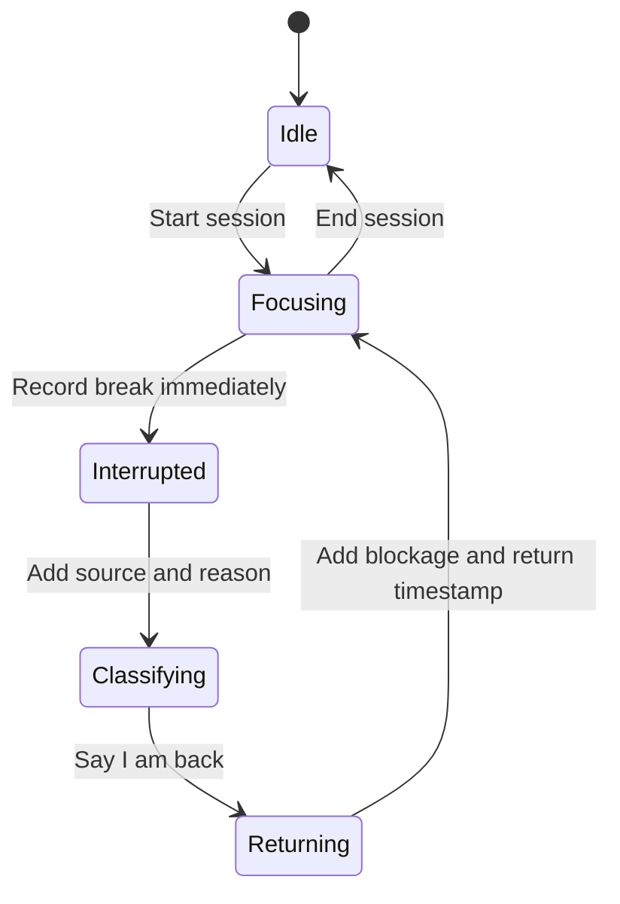

## Context

The current application shell has Life, Trade, and History tabs backed by in-memory session state. There is no production persistence container. The product already declares manually reported attention interruptions as a future same-product event source and explicitly rejects automatic app-switch judgment. See `proposal.md` and `specs/focus-interruption-journal/spec.md` for the visible contract.

## Goals / Non-Goals

**Goals:**

- Persist a small, inspectable event chain entirely through Apple system frameworks.
- Make interruption capture immediate while collecting reason and return blockage at moments when each answer is knowable.
- Derive daily and aggregate summaries deterministically from timestamps and bounded classifications.
- Keep the surface visually continuous with the Powder Sky, navy, Cherry, white-material, and thread metaphors already established.
- Isolate on-device language-model tagging behind an availability-aware protocol.

**Non-Goals:**

- Automatic app or website monitoring, Screen Time authorization, blocking, notifications, Pomodoro behavior, task management, coaching, scores, or streaks.
- CloudKit synchronization, accounts, shared data, or external analytics.
- Letting a generated tag overwrite explicit human classification.

## Decisions

### Add a fourth native Focus tab

`IndulgeAppTab` gains `focus`, preserving the standard `TabView` architecture and keeping History as the factual record of completed trades. Focus owns the active attention state and its interruption journal; it does not turn Life into a dashboard.

Alternative considered: merge focus events into History. Rejected because recording an active break is a frequent primary action, while History is retrospective and currently teaches the trade record.

### Persist event records with local SwiftData

The application root supplies one SwiftData model container for `FocusSessionRecord` and `FocusInterruptionRecord`. A session stores identity, optional intention, start, and optional end. An interruption stores its session identifier, start, optional return, bounded source/reason/blockage raw values, and optional note. Explicit identifiers avoid a fragile relationship graph while the schema is young; interruption deletion follows session deletion in repository logic.

The default model configuration stores data in the app container. No CloudKit entitlement is added. Tests construct an in-memory container.

Alternative considered: `UserDefaults` with one Codable blob. Rejected because querying days, recovering incomplete events, and evolving the schema would require rewriting the entire blob and duplicating persistence coordination.

### Derive the runtime state from persisted incomplete records

One session with `endedAt == nil` is active. Within it, one interruption with `returnedAt == nil` is active. Starting, interrupting, returning, and ending are transactional repository operations; the visible state is re-fetched from SwiftData rather than held only in transient view state.

The initial interruption transition writes first, so classification never delays the recovery timer. The blockage is requested on return because it often is not knowable at the moment focus breaks.

### Use bounded, non-clinical classifications

The source has three values: external, drift, and environment. Reasons and blockages use short authored enums covering people/calls, messages, task difficulty, random thoughts, noise, body needs, urgent demands, tempting content, unclear next steps, emotion, fatigue, environment, other, and not sure. Optional notes preserve nuance without making the summary depend on free text.

Alternative considered: free-form tags only. Rejected because daily grouping would become inconsistent and the first useful summary would depend on model availability.

### Compute summaries in pure domain code

`FocusSummary` functions accept value snapshots plus a calendar and reference date. They split elapsed session and interruption durations at local day boundaries, compute daily counts and recovery totals, and choose repeated patterns with stable authored tie-breaking. Aggregate claims remain unavailable below three completed interruptions.

This domain layer has no SwiftUI, SwiftData, or Foundation Models dependency, making date boundaries and wording testable in isolation.

### Treat Foundation Models as a suggestion provider

`FocusTagSuggesting` returns optional bounded suggestions. The default manual implementation returns no suggestion. On supported operating systems, an Apple implementation checks `SystemLanguageModel.default.availability`, uses guided generation to map an optional note into the existing enums, and returns nothing on ineligibility, disabled intelligence, model-not-ready, unsupported language, or generation failure.

The UI never blocks on this call. A suggestion is visibly optional and requires confirmation. Explicit selections win, and all summaries operate on the bounded stored values rather than regenerated text.

Alternative considered: automatically tag every note. Rejected because the feature must remain immediate, predictable, and fully useful without Apple Intelligence.

### Show a living attention thread, not a productivity dashboard

Focus inherits the existing scene and white tray. A compact thread visualization grows during focus, opens a visible gap during recovery, and marks completed interruptions with Cherry cuts. The primary button changes among Start focus, I was interrupted, I am back, and End session. Today and prior days use readable sentences and compact rows rather than streaks, rings, or invented charts.

The screen is an Operate-mode extension of the existing world, so it does not create a new visual direction or require new character art.

## Risks / Trade-offs

- [A session spans midnight] → Split elapsed intervals at calendar-day boundaries in summary code while retaining one source record.
- [The app terminates during an interruption] → Restore the incomplete interruption and continue recovery timing from its persisted timestamp.
- [Two incomplete sessions appear after an interrupted write] → Repository startup repair keeps the newest active and closes older records at the newer start without inventing interruption metadata.
- [Model output changes across OS updates] → Keep generated tags bounded, optional, confirmed, and covered by a deterministic manual fallback.
- [SwiftData schema changes later require migration] → Keep V0 models flat and add an explicit schema migration plan before any incompatible release.
- [Manual capture adds friction] → Persist on the first tap, use one-screen bounded choices, and ask blockage only when returning.

## Migration Plan

1. Add flat SwiftData models and configure a local model container at the application root.
2. Add pure summary and repository operations with in-memory persistence tests.
3. Add Focus to the native tab shell and deterministic launch presets.
4. Add the thread states, classification sheets, daily rows, and aggregate learning state.
5. Add the optional Foundation Models suggestion boundary behind availability checks.
6. Existing installs create an empty local store; no legacy user data or CloudKit migration exists.
