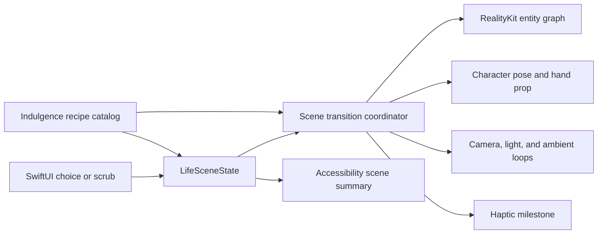

## Context

The repository is a new local iOS project with product and visual direction
captured in `PRODUCT.md` and `DESIGN.md`. The owner approved an original,
abstract soft-form 3D scene based on a supplied quality benchmark. Direction A
establishes the object-by-object onboarding assembly; direction C establishes
the continuous Now ↔ Possible morph. See `proposal.md` for motivation and the
three capability specs for observable behavior.

The installed Apple toolchain includes RealityKit scene presentation for iOS,
native entity animation, and Reality Composer Pro. The first proof must remain
reviewable without paid assets, third-party runtime dependencies, a backend, or
Screen Time entitlements.

## Goals / Non-Goals

**Goals:**

- Prove the art direction and the six hero animation beats in a real iPhone
  simulator build.
- Make the scene state reusable by later onboarding, Life, and History surfaces.
- Keep scene rendering separate from native controls, accessibility, and copy.
- Establish a path from procedural prototype geometry to a production character
  and prop asset package without changing product behavior.

**Non-Goals:**

- Production skeletal character art, a full avatar editor, or a final Rive rig.
- Screen Time authorization, shields, extensions, persistence, notifications,
  widgets, analytics, or a Significant Hobbies network integration.
- Behavioral recommendation of alcohol, smoking, or other sensitive companions;
  supported sensitive props mirror explicit user context only.
- Free-roaming 3D navigation, AR placement, physics-driven gameplay, or an
  Android/web implementation.

## Decisions

### Use SwiftUI with a RealityKit `RealityView`

SwiftUI owns the app lifecycle, navigation, copy, controls, haptics,
accessibility, and adaptive layout. RealityKit owns the character and scene.
This uses Apple’s native 3D presentation and entity model, supports authored or
procedural assets, and keeps the experience appropriate for iPhone.

Rive remains a possible later tool for small 2D effects but is not the primary
renderer because the approved world depends on true modular depth, camera
parallax, lighting, and detachable 3D props. Sprite sheets and pre-rendered video
were rejected because they cannot respond continuously to user-selected state.

### Prototype with original procedural entities behind stable asset roles

The first pass constructs the stage, sofa, television, lamp, hand prop, ambient
objects, and a simplified articulated character from rounded RealityKit meshes
and matte materials. Each entity receives a stable semantic role and anchor.
This avoids stock licensing and lets motion be tuned immediately.

The production art pass can replace each procedural role with a Reality Composer
Pro or USDZ entity that preserves the same anchor names, bounds, pivot intent,
and animation contract. The prototype is therefore a real behavior proof, not a
throwaway static mock.

### Model 20–30 indulgences as recipes, not bespoke scenes

The scene library is a content catalog. Each `IndulgenceRecipe` selects one base
pose, one environment cluster, zero or more companion sockets, a camera target,
an ambient-loop set, and an arrival sequence. Recipes reuse assets and animation
clips; they do not subclass the renderer or embed view logic.

The initial catalog groups indulgences by scene mechanics—watching, handheld
scrolling, desk/browsing, gaming, listening, eating/drinking, shopping, resting,
and social connection—then composes specific labels and props within those
families. A compatibility matrix limits a companion to sockets and poses that
can hold it cleanly. Sensitive companions such as wine or smoking are marked
`explicitOnly` and are never returned by default recommendations.

### Drive one entity graph from one `LifeSceneState`

`LifeSceneState` contains the character variant, indulgence, companion prop,
possible-life progress, completed replacement, history week, graduation state,
and motion preference. A scene coordinator maps that value to transforms,
visibility, material parameters, pose targets, camera framing, and semantic
summary.

The coordinator owns cancellation and transition generation so a new state
begins from the currently presented transforms rather than from stale logical
end values.

### Author motion as named multi-phase transitions

Major transitions are named sequences (`presentLife`, `assembleWatching`,
`scrubPossible`, `completeReplacement`, `morphWeek`, `graduate`) made of
anticipation, arrival, character response, and settle phases. Entity transforms
are changed together to avoid conflicting animations; completion callbacks drive
the next phase and haptic milestone.

The Now ↔ Possible interaction is a continuous progress value and interpolates
between authored key states. Other hero beats are discrete and replayable.
Ambient loops run only after the scene is settled and pause during hero motion.

### Keep the camera authored and non-interactive

The visual proof uses a perspective camera with shallow movement and fixed
framing targets. Users interact with choices and the scrub control, not with a
free camera. This preserves composition, prevents gesture conflict with native
navigation, and keeps the character readable on small iPhones.

### Treat accessibility as an alternate presentation, not a disabled version

SwiftUI reads Reduce Motion, increased contrast, differentiate-without-color,
and Dynamic Type environment values. Reduce Motion chooses a parallel transition
recipe with ordered opacity/in-place changes and no simulated depth motion. The
RealityKit view is exposed as one semantic scene element with an updated summary;
decorative child entities are hidden from the accessibility tree.

### Use deterministic demo state and lightweight verification

The prototype launches into a deterministic review flow with controls to replay
each hero beat. Unit tests cover state-to-scene recipes and reduced-motion
selection. Simulator checks cover build, interaction, VoiceOver labels, text
scaling, orientation policy, and screenshots. No network or entitlement is
required.

## Risks / Trade-offs

- **Procedural character looks too primitive** → Spend the first implementation
  on silhouette, proportions, materials, camera, and authored motion; keep a
  clean asset-role boundary for a later artist-authored rig.
- **RealityKit API availability narrows device support** → Set and document a
  minimum iOS version supported by `RealityView`, then test against the oldest
  installed matching simulator before adding newer-only animation APIs.
- **Too many separate entities reduce mobile performance** → Reuse materials,
  keep geometry simple, cap ambient loops, pause offscreen work, and profile the
  proof before adding detail.
- **Catalog breadth creates combinatorial animation debt** → Validate recipes
  against a finite pose/socket compatibility matrix and reject unsupported
  combinations instead of adding one-off renderer branches.
- **Sensitive props look like recommendations** → Require explicit user choice,
  exclude them from defaults and ranking, use neutral copy, and prohibit reward
  effects in both specs and catalog validation.
- **Generated comps are mistaken for literal asset specifications** → Record
  them as composition and quality references only; implement original geometry
  and preserve semantic native controls.
- **Motion becomes decorative or repetitive** → Give each named hero transition
  a distinct causal sequence and audit with Reduce Motion enabled.
- **3D obscures native usability** → Keep navigation and controls in SwiftUI,
  maintain safe areas and 44pt targets, and make the scene a single semantic
  accessibility element.

## Migration Plan

This is a greenfield local proof, so no user or production data migration is
required. Land the project scaffold and deterministic static scene first, add
transitions one at a time behind replayable demo controls, and keep the app
buildable after each phase. A problematic hero transition can be disabled by
mapping its state directly to its settled transform without affecting the scene
model or other beats.
