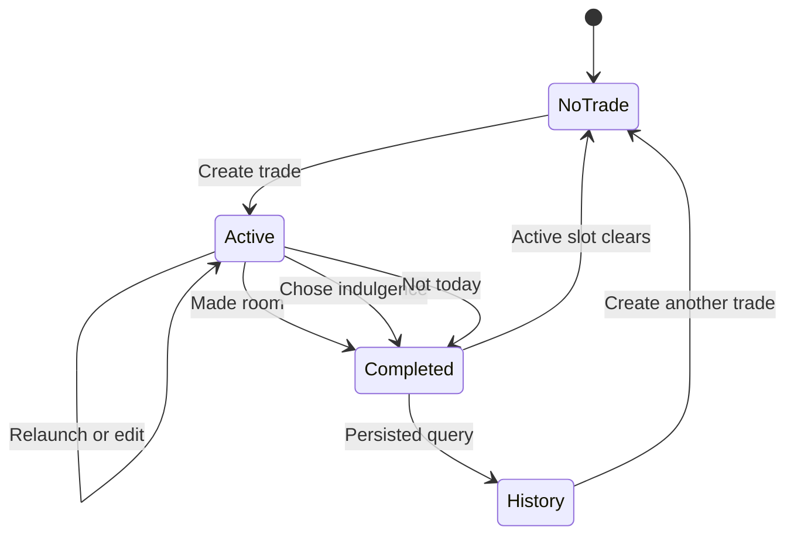

## Context

See `proposal.md` for motivation. The app already persists the onboarding profile and optional generated card in SwiftData, prepares private CloudKit on signed devices, and owns a complete RealityKit proof plus high-quality authored scene plates. The daily `ActiveTrade` is currently view state, History cannot receive a completed record, the production shell does not reuse the full scene-motion system, and the repository still contains Cloudflare Pages deployment infrastructure for a separate static site.

The minimum runtime is iOS 18. The current Xcode 27 toolchain can compile newer Apple capabilities behind availability checks, but essential behavior must remain deterministic on iOS 18 and in the simulator.

## Goals / Non-Goals

**Goals:**

- Make one daily trade durable and completable, with truthful history and all-data deletion.
- Reuse the current authored visual identity and causal motion in normal customer routes.
- Preserve local-first behavior and private CloudKit compatibility without an account wall.
- Remove Cloudflare-specific infrastructure and prove the archived native runtime has no such dependency.
- Produce reproducible simulator, signed-device, accessibility, and archive evidence.

**Non-Goals:**

- Automatic app blocking, Screen Time authorization, background monitoring, or focus tracking.
- AI coaching, diagnosis, remote inference, or generated factual claims.
- Uploading a build, promoting a CloudKit production schema, committing, pushing, or deploying.
- Replacing the approved scene plates with the lower-fidelity procedural review character.

## Decisions

### Add a versioned trade record instead of persisting view state

`TradeRecord` will use a stable UUID and raw-value fields compatible with SwiftData and private CloudKit. One optional completion value and timestamps represent draft/active/completed state. A lightweight V1→V2 migration adds the model without rewriting legacy records. A repository enforces one active record and provides deterministic create, begin, complete, replace, history, and delete operations.

Alternatives considered: serializing `ActiveTrade` in `UserDefaults` would not synchronize, query, or participate in all-data deletion cleanly; reusing legacy Focus models would preserve the wrong domain and contaminate history.

### Make record state authoritative and UI state derived

The app shell queries trade records from the shared model container. Life, Trade, and History derive their content from the same active/completed data, so tab changes and relaunches cannot disagree. Destructive replacement and completion are explicit native confirmation flows; double submission is disabled while a write is in progress.

### Animate the high-quality authored plates in production

The customer journey will keep the current scene plates and add a shared SwiftUI scene presenter that owns bounded parallax, breathing, practical-light drift, scene-state crossfades, and completion-pocket arrival. The existing RealityKit proof remains the semantic asset/motion reference and can replace plates when equivalent production rig quality exists. This preserves the user-approved image quality rather than exposing the visibly rougher procedural character.

Reduce Motion selects a settled crossfade-only path. Scene animation tasks stop when offscreen or backgrounded. Scene identity, gender-selected presentation, furniture, primary prop, and room continuity remain deterministic.

### Keep generative Apple capabilities optional

History summaries will initially use deterministic calculations. Foundation Models is not required to complete the loop; if added later, it consumes only structured aggregates and emits bounded optional wording. Image Playground remains an explicit system sheet and never replaces the authored room.

### Remove the provider, not the trust content

Cloudflare configuration, Wrangler, deploy scripts, provider origins, and provider-specific documentation will be removed. Static privacy/support content may remain buildable and provider-neutral because Apple distribution requires stable public support and privacy URLs, but it is not part of the native runtime and no deployment is performed here.

### Separate device-testing archives from TestFlight archives

The archive script will keep the personal-team guard but will describe development-signed output accurately. A verification script inspects identity, `get-task-allow`, iCloud environment, bundle/version, privacy manifest, and linked frameworks. It only reports TestFlight-ready when App Store distribution evidence is present; upload remains a separate explicitly authorized command.

## Risks / Trade-offs

- [CloudKit schema additions require compatible defaults] → Keep every new stored property initialized, use a lightweight versioned migration, and test local reopen before signed-device sync.
- [High-quality plates are not free-camera 3D] → Use the existing native causal-motion vocabulary and preserve an asset-role boundary for later rig replacement; do not regress visible quality to claim 3D.
- [A physical device may lack Apple Intelligence or Image Playground] → Treat unsupported states as complete fallbacks and report supported-device checks separately.
- [Free-team signing cannot prove TestFlight distribution] → Verify signed device installation now, make tooling reject an inaccurate TestFlight-ready label, and require distribution signing before any future upload claim.
- [Removing provider configuration can leave stale product claims] → Search source, scripts, manifests, docs, status, and lockfiles, then run the static site check without provider-specific tooling.

## Migration Plan

1. Add and locally reopen the V2 SwiftData schema before changing UI callers.
2. Introduce the repository and unit tests, then replace app-shell view state with persisted queries.
3. Add completion/history UI and UI automation for relaunch and populated history.
4. Add the shared animated scene presenter and verify standard/Reduce Motion paths.
5. Remove Cloudflare-specific files and dependencies, update provider-neutral documentation, and regenerate lockfiles.
6. Run simulator matrices, install a signed development build on compatible hardware when available, inspect the archive, and retain evidence.

Rollback keeps V1 binaries readable only before a V2 store is created; therefore distribution is not performed until the V2 migration and signed-device launch are verified. CloudKit production schema promotion remains separate and explicitly authorized.
